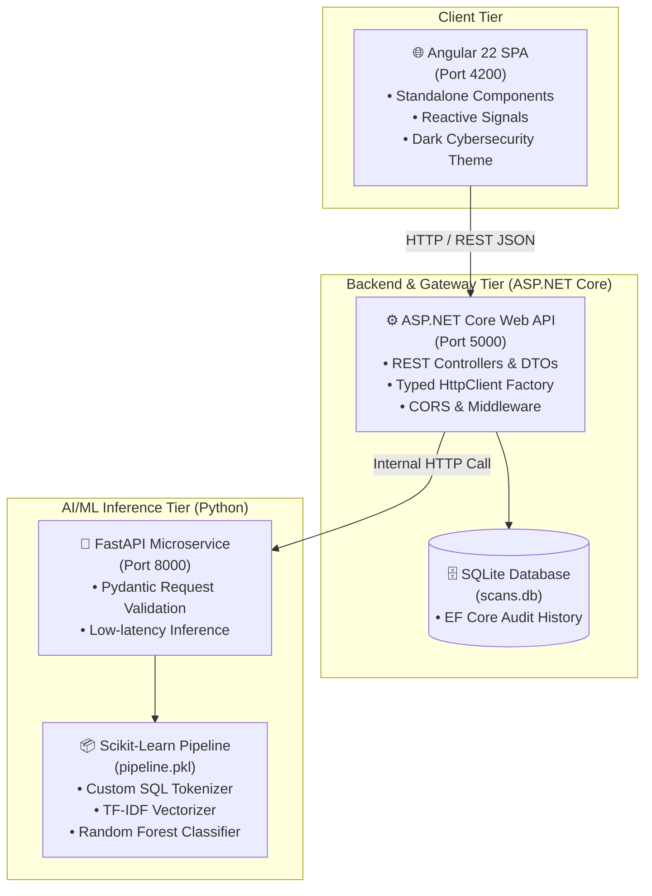

# 🛡️ SQLShield AI - Intelligent SQL Injection Detection System

[](https://angular.dev/)
[](https://dotnet.microsoft.com/)
[](https://fastapi.tiangolo.com/)
[](https://scikit-learn.org/)
[](https://www.docker.com/)

**SQLShield AI** is an full-stack, full-stack cybersecurity application designed to detect, classify, and analyze **SQL Injection (SQLi)** attacks in real-time using Machine Learning.

An ML-based alternative to fixed-rule filters, SQLShield AI uses TF-IDF n-gram feature extraction and trained compared Random Forest, MLP and Naive Bayes, and chose Random Forest with specialized tokenization to detect both classic and heavily obfuscated SQL injection attacks.

---

## 🌟 Key Features

- **⚡ Real-Time Query Inspector:** Instant classification of SQL queries into **Benign / Normal** or **Malicious SQL Injection**.
- **📊 Confidence & Risk Gauge:** Displays model prediction probability with dynamic color-coded threat level indicators.
- **🎯 One-Click Preset Payloads:** Pre-loaded test cases for auth-bypass, UNION attacks, stacked queries, blind injection, and safe queries.
- **📜 Persistent Audit Logging:** Every scanned payload is logged with timestamp, verdict, and confidence into a SQLite database via Entity Framework Core.
- **🧩 3-service architecture:** Clean separation of concerns between presentation, business logic/gateway, and ML inference.
- **🐳 Full Containerization:** Launch all services with a single `docker compose up` command.

---

## 🏗️ System Architecture



---

## 📂 Project Structure

```text
SQLShield-AI/
├── frontend/                     # 🌐 Angular 22 Single Page Application
│   ├── src/app/
│   │   ├── services/             # DetectionService (HTTP communication)
│   │   ├── app.ts                # Main Standalone Component (Signals)
│   │   ├── app.html              # Modern Dashboard Template
│   │   ├── app.scss               # Cybersecurity Dark Theme Styles
│   │   └── app.config.ts         # provideHttpClient configuration
│   ├── Dockerfile
│   └── nginx.conf
│
├── Backend/                      # ⚙️ ASP.NET Core Web API
│   ├── Controllers/              # DetectionController.cs (/analyze, /history)
│   ├── DTOs/                     # AnalyzeRequestDto.cs, AnalyzeResponseDto.cs
│   ├── Services/                 # IMlInferenceService.cs & MlInferenceService.cs
│   ├── Data/                     # AppDbContext.cs (EF Core SQLite)
│   ├── Program.cs                # CORS, DI, SQLite setup
│   └── Dockerfile
│
├── ml_service/                   # 🧠 Python Machine Learning Microservice
│   ├── api.py                    # FastAPI application (/predict, /health)
│   ├── src/
│   │   ├── predict.py            # Model loading & probability prediction
│   │   ├── train.py              # ML model training & 5-fold cross validation
│   │   ├── preprocess.py         # Dataset cleaning & normalization
│   │   ├── utils.py              # Custom SQL regex tokenizer
│   │   └── config.py             # Path & parameter configuration
│   ├── data/
│   │   ├── raw/                  # Place the downloaded Kaggle dataset here (data.csv)
│   │   └── processed/            # cleaned_data.csv (generated by preprocess.py)
│   ├── models/                   # Serialized pipeline.pkl (generated by train.py)
│   ├── outputs/                  # Model comparison reports & metrics (generated)
│   ├── requirements.txt          # Python dependencies
│   └── Dockerfile
│
├── docker-compose.yml            # Multi-container orchestration
├── .gitignore                    # Git ignore rules
└── README.md                     # Documentation
```

---

## 📊 Dataset

The classifier is trained on the **SQL Injection Dataset** from Kaggle:

- **Link:** https://www.kaggle.com/datasets/sajid576/sql-injection-dataset
- Download it manually and place the CSV at:
  ```text
  ml_service/data/raw/data.csv
  ```

The file must contain (at minimum) these two columns:

| Column | Description |
|--------|-------------|
| `text` | SQL query, payload, or input string |
| `label` | `0` = normal, `1` = SQL injection |

> If your CSV has extra/shifted columns (e.g. `text,label,Unnamed: 2,Unnamed: 3`), `preprocess.py` automatically detects and recovers the correct label column. If `data/raw/data.csv` is missing entirely, `preprocess.py` will print an error and exit — the dataset must be downloaded manually from the link above.

A pretrained `pipeline.pkl` is **not** committed to this repository (see [`.gitignore`](.gitignore)). You must train it yourself the first time you run the project locally — see [Training the Model](#-training-the-model-required-before-first-run) below.

---

## 🚀 How to Run the Project

### Option A: Using Docker Compose (Recommended - 1 Command)

Ensure you have [Docker Desktop](https://www.docker.com/products/docker-desktop/) installed, and that you've already trained a model (`ml_service/models/pipeline.pkl` exists — see below) before building, since the FastAPI container loads it at startup.

```bash
# Clone the repository
git clone https://github.com/3mrm6r/SQLShield-AI.git
cd SQLShield-AI

# Build and start all 3 services
docker compose up --build
```

Access the applications:
- **Angular Frontend:** [http://localhost:4200](http://localhost:4200)
- **ASP.NET Core API:** [http://localhost:5000/openapi/v1.json](http://localhost:5000/openapi/v1.json)
- **FastAPI ML Docs:** [http://localhost:8000/docs](http://localhost:8000/docs)

---

### Option B: Running Services Manually (Local Development)

#### 1. Set Up the Python Environment

```bash
# From project root
python3 -m venv .venv
source .venv/bin/activate      # Windows (PowerShell): .venv\Scripts\Activate.ps1
pip install -r ml_service/requirements.txt
```

#### 2. Training the Model (required before first run)

Download the dataset first — see [Dataset](#-dataset) above — then, from the project root with `.venv` activated:

```bash
# Step 1 — Clean and preprocess the raw dataset
PYTHONPATH=ml_service python3 -m src.preprocess
```
Reads `ml_service/data/raw/data.csv`, cleans/deduplicates it, and saves the result to `ml_service/data/processed/cleaned_data.csv`.

```bash
# Step 2 — Train and compare models, save the best one
PYTHONPATH=ml_service python3 -m src.train
```
Trains Naive Bayes, Random Forest, and an MLP Neural Network, runs 5-fold cross-validation, and saves the best-performing pipeline to `ml_service/models/pipeline.pkl`. Comparison metrics are written to `ml_service/outputs/reports/`.

#### 3. Start the Python ML Service (FastAPI)

```bash
# From project root, with .venv still activated
uvicorn ml_service.api:app --host 0.0.0.0 --port 8000 --reload
```
FastAPI preloads `pipeline.pkl` into memory at startup. Restart this service any time you retrain the model.

#### 4. Start the ASP.NET Core Web API

```bash
# In a new terminal tab
cd Backend
dotnet restore
dotnet run --launch-profile http
# Backend runs on http://localhost:5000
```

#### 5. Start the Angular Frontend

```bash
# In a new terminal tab
cd frontend
npm install
npm start
# Frontend runs on http://localhost:4200
```

Open **http://localhost:4200** in your browser once all three services are running.

---

## 📡 API Endpoints

### ASP.NET Core Gateway (`http://localhost:5000`)
| Method | Endpoint | Description |
| :--- | :--- | :--- |
| `POST` | `/api/detection/analyze` | Analyzes a query string and logs verdict to DB |
| `GET` | `/api/detection/history` | Retrieves the 20 most recent scan logs |

#### Sample Request (`POST /api/detection/analyze`):
```json
{
  "query": "admin' OR '1'='1"
}
```

#### Sample Response:
```json
{
  "id": 1,
  "query": "admin' OR '1'='1",
  "label": "SQL Injection",
  "confidence": 0.95,
  "isSqlInjection": true,
  "scannedAt": "2026-09-21T01:00:00Z"
}
```

---

## 🧪 Machine Learning Details

- **Custom Tokenizer (`sqli_tokenizer`):** Uses specialized regular expression tokenization that preserves syntax-critical characters (`'`, `"`, `--`, `/*`, `;`, `#`, `=`, `(`, `)`) rather than stripping them like generic NLP tokenizers.
- **Vectorization:** TF-IDF with unigram and bigram ranges `(1, 2)`, `min_df=5`, `max_features=2000` to capture phrases like `UNION SELECT` and `OR 1=1`.
- **Model Evaluation:**
  - **Random Forest:** Accuracy ~99.58% accuracy, 99.43% F1 on the test set, 5-Fold Cross Validation F1: 98.7%
  - **MLP Neural Network:** 5-Fold CV F1: 97.3%
  - **Multinomial Naive Bayes:** Baseline F1: 93.3%

---

## 🐛 Troubleshooting

- **Port 5000 or 8000 already in use:**
  ```bash
  lsof -i :5000   # or :8000
  kill -9 <PID>
  ```
- **`ModuleNotFoundError: No module named 'src'`** when running preprocess/train: make sure `PYTHONPATH=ml_service` is set correctly (note the underscore, not a hyphen) and that you're running the command from the project root.
- **FastAPI can't find `pipeline.pkl`:** you must run the [training steps](#2-training-the-model-required-before-first-run) at least once before starting `uvicorn`.

---

## 📄 License
This project is open-source and available under the [MIT License](LICENSE).
